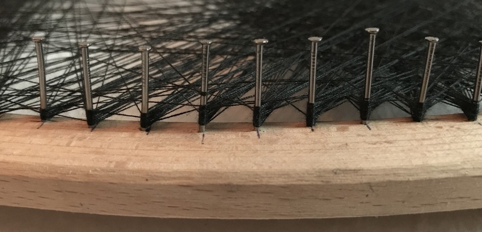

# Knitting

One thread knitting problem, but with deeper optimization algorithms and a
touch of machine learning to achive the best approximation possible.

Features:

- can select the best crop of image (the easiest one to knit
- can produce a set of steps for manual knitting such as:
    - the knitting can be interrupted at any moment (allows the artist to
      control the final contrast)
    - allows for different frame sizes
    - allows for different thread espesor

## Fitness criteria

A good portrait is one the viewer easily identify with the subject.
That's why I decided to base the fitness functions on human eye/brain features.

- Render function must address `moire` issues.
- Unfocus filter must be applied before comparation based on know dimensions of
  the frame and distance of the observer
- Linear transformations should have limited effect on fitness
    - adjust brightness and contrast before comparation
    - adjusted values for brightness and contrast are used as part of fitness
      output

## Knitter function

This is the procedure that creates the image, given target image.

Features:

- returns a list of steps for knitting

## Render function

Creates the image given the knitting steps

- avoids `moire patterns` formation

## Fast Render Function

Must create a knitted image using the given weights

- avoids `moire patterns` formation

# TODO:

- Create fitness criteria tests
- TDD fitness functions
- Create variable-deep thread finder
- Create Newton fast approximation for smart cropping
- Use Newton weights to prioritize thread finder
- Implement pre-processing options (sobel?)
